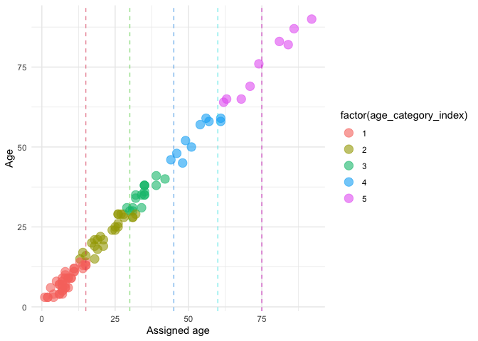

For the elephant data we are working with, ages are assigned to category
bins, rather than actual ages. There are problems with this: the chance
of being mis-classified is lower if an actual age is in the middle of
the age category; also, there would bea bias towards ages within the age
class actually being towards the lower end of the class. To deal with
this we developed a Bayesian model to estimate age distributions for
each individual from the categories, assuming that ages originally come
from a Weibull distribution.

This notebook documents code that first *simulates the process of
assigning age categories to elephants*, and then *tests the Bayesian
Stan model’s ability to assign age distributions to individuals* based
on their age category.

The code also *highlights the problem in using age category bins* and
why we want to do this.

``` r
library(cmdstanr)
```

    ## This is cmdstanr version 0.4.0

    ## - Online documentation and vignettes at mc-stan.org/cmdstanr

    ## - CmdStan path set to: /Users/dan/.cmdstanr/cmdstan-2.28.2

    ## - Use set_cmdstan_path() to change the path

    ## 
    ## A newer version of CmdStan is available. See ?install_cmdstan() to install it.
    ## To disable this check set option or environment variable CMDSTANR_NO_VER_CHECK=TRUE.

``` r
library(tidyverse)
```

    ## ── Attaching packages ─────────────────────────────────────── tidyverse 1.3.1 ──

    ## ✓ ggplot2 3.3.5     ✓ purrr   0.3.4
    ## ✓ tibble  3.1.6     ✓ dplyr   1.0.7
    ## ✓ tidyr   1.1.4     ✓ stringr 1.4.0
    ## ✓ readr   2.1.0     ✓ forcats 0.5.1

    ## ── Conflicts ────────────────────────────────────────── tidyverse_conflicts() ──
    ## x dplyr::filter() masks stats::filter()
    ## x dplyr::lag()    masks stats::lag()

``` r
library(ggdist)
```

First let’s simulate an age distribution based on a Weibull distribution
where we set the shape and scale parameters.

``` r
probs <- dweibull(1:100, shape = 1.2, scale = 30)
probs <- (probs/sum(probs))
plot(probs) 
```


Now we create a fictional population with ages selected from that
distribution. We also add an error for age estimation.

``` r
N <- 100 # Number of individuals
K <- 6 # Number of age bin categories
elephants_ls <- list(
  N = N,
  K = K, 
  # Simulated ages drawn from the Weibull distribution plus an error in age estimation
  age = sample(1:100, N, replace=TRUE, prob=probs)
  #age_category_index = sample(1:4,20,replace=TRUE)
)
```

Next simulate observing ages with error and then binning them into age
groups

``` r
E <- 3 # Error (in either direction) of age estimates
elephants_ls$age_guess <- elephants_ls$age + sample(-E:E, N, replace=TRUE)
elephants_ls$age_category_index <- sapply(elephants_ls$age_guess, function(x) which.max(x < c(15, 30, 45, 60, Inf)))
hist(elephants_ls$age_category)
```


Let’s look at the actual age verses the biologist assigned age and look
at the thresholds. You can see that the chance of being mis-classified
is lower if an actual age is in the middle of the age category. Also,
there is mostly a bias towards ages within the age class actually being
towards the lower end of the class.

``` r
data.frame(elephants_ls) %>%
  ggplot(aes(x=age, y=age_guess, col=factor(age_category_index))) +
    geom_point(size=4,alpha=0.6) +
    geom_vline(xintercept=c(15,30,45,60,75), col=factor(2:6), linetype="dashed", alpha=0.6) +
    theme_minimal() + 
    xlab("Assigned age") + ylab("Age")
```



Now we read in the Stan model to estimate ages from the categories based
on a Weibull distribution (for real data these will be centred on
parameters from fitting to age estimates based on another elephant
population)

``` r
latent_age_ordinal_model <- cmdstan_model("elephant_latent_age_ordinal_regression.stan")
```

Fit model with cmndstanr

Examine the estimates. We can plot the estimated ages against the
biologist assigned ages and …

``` r
age_est_mat <- age_estimation_fit$summary()[102:201, ]

plot_data <- data.frame(age = elephants_ls$age, # Biologists original age est
                        model_age = age_est_mat$mean) # Mean modelled age

plot_data %>%
  ggplot(aes(x=factor(age), y=model_age)) +
    geom_point(size=4,alpha=0.6) +
    geom_vline(xintercept=c(15,30,45,60,75), linetype="dashed", alpha=0.6) +
    theme_minimal() + 
    xlab("Assigned age") + ylab("Modelled ge")
```


Now an equivalent posterior predictive plot from draws from the
distribution to show uncertainty around the mean age (then need to do it
with full uncertainty).

``` r
library(posterior)
```

    ## This is posterior version 1.1.0

    ## 
    ## Attaching package: 'posterior'

    ## The following objects are masked from 'package:stats':
    ## 
    ##     mad, sd, var

``` r
true_ages <- age_estimation_fit$draws("true_age", format="df")
#mcmc_dens(true_ages)
true_ages <- true_ages[1:100,1:N]
```

    ## Warning: Dropping 'draws_df' class as required metadata was removed.

``` r
df <- as.data.frame(do.call(rbind, true_ages)) %>%
            mutate(true_age = elephants_ls$age) %>% relocate(true_age) %>%
            mutate(ID = 1:nrow(true_ages)) %>% relocate(ID)

df <- df %>% pivot_longer(cols = 3:102) %>% select(-name)

df %>% ggplot(aes(x=true_age, y=value, group=factor(ID))) +
    geom_point(size=2,alpha=0.1) +
    #stat_halfeye() +
    geom_vline(xintercept=c(15,30,45,60,75), linetype="dashed", alpha=0.6) +
    geom_hline(yintercept=c(15,30,45,60,75), linetype="dashed", alpha=0.6) +
    theme_bw() + 
    xlab("Assigned age") + ylab("Modelled age")
```


